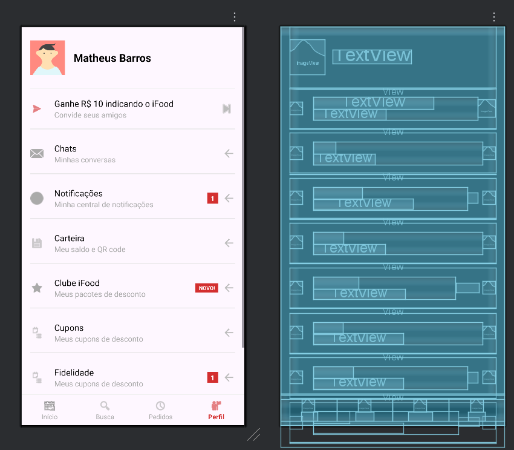

  <h1>
    Clone da Interface do iFood (Tela Inicial)
  </h1>

  
  
  

  Recriação da tela inicial do iFood, um desafio de UI para Android focado em componentes como CardViews, rolagem horizontal e vertical.

  <a href="#-sobre-o-projeto">Sobre</a> •
  <a href="#-tecnologias-utilizadas">Tecnologias</a> •
  <a href="#-como-usar">Como Usar</a> •
  <a href="#-demonstração">Demonstração</a> •
  <a href="#-licença">Licença</a>

---

### 🎯 Sobre o Projeto

Este projeto é uma réplica da tela inicial do iFood, desenvolvido como um exercício prático para aprimorar minhas habilidades em design de interfaces no Android. O foco foi estruturar um layout complexo que combina diferentes tipos de visualização de dados, como banners, listas de categorias e cards de restaurantes, dentro de um `ScrollView` principal. Foi um projeto acadêmico que serve como uma excelente peça para meu portfólio de desenvolvimento mobile.

---

### 🛠️ Tecnologias Utilizadas

A interface foi construída utilizando as ferramentas padrão do desenvolvimento Android nativo.

  
  
  

---

### ⚙️ Como Usar

Para visualizar este layout:
1.  Crie um novo projeto no Android Studio.
2.  Copie o conteúdo do arquivo `ifood.xml` para o seu arquivo de layout principal (ex: `res/layout/activity_main.xml`).
3.  Na sua `MainActivity.kt` ou `MainActivity.java`, certifique-se de que o layout está sendo carregado: `setContentView(R.layout.activity_main)`.
4.  Execute o aplicativo em um emulador ou dispositivo físico.

---

### 🎬 Demonstração

  

<strong>💡 Análise da Estrutura do Layout (Write-up)</strong>

 

A complexidade da tela inicial do iFood foi abordada com uma combinação estratégica de layouts para garantir a performance e a fidelidade visual:

1.  **Layout Raiz (`ScrollView`)**: Como a tela possui mais conteúdo do que cabe na vertical, um `ScrollView` foi usado como contêiner principal, permitindo a rolagem de toda a página. Dentro dele, um `ConstraintLayout` organiza as seções.

2.  **Barra Superior (Header)**: Fixada no topo, contém o endereço do usuário, um ícone de dropdown e o ícone de perfil. O `ConstraintLayout` facilita o alinhamento desses elementos.

3.  **Barra de Busca (`EditText`)**: Estilizada com cantos arredondados e um ícone para se assemelhar ao componente nativo do app.

4.  **Categorias (`HorizontalScrollView`)**: Uma lista de categorias rolável horizontalmente foi implementada com um `HorizontalScrollView` contendo `CardViews` ou `Buttons` para cada item (Restaurantes, Mercado, etc.).

5.  **Conteúdo Principal**:
    -   **Banners Promocionais**: Implementados com `CardView` para dar o efeito de elevação e cantos arredondados, contendo uma `ImageView`.
    -   **Cards de Restaurantes**: O elemento mais complexo. Cada restaurante é um `CardView` que agrupa vários `TextViews` (nome, avaliação, categoria, tempo, frete) e uma `ImageView` (logo). O `ConstraintLayout` dentro do card é ideal para posicionar esses múltiplos elementos de forma eficiente e responsiva.

6.  **Barra de Navegação Inferior (`LinearLayout`)**: Fixada na parte inferior, utiliza um `LinearLayout` horizontal com `layout_weight` para garantir que os itens (Início, Busca, Pedidos, Perfil) ocupem o mesmo espaço.

---

### 📝 Licença

Este projeto está sob a licença MIT.

  Desenvolvido por <b>Marcos Vinícius Rocha Silva</b>

